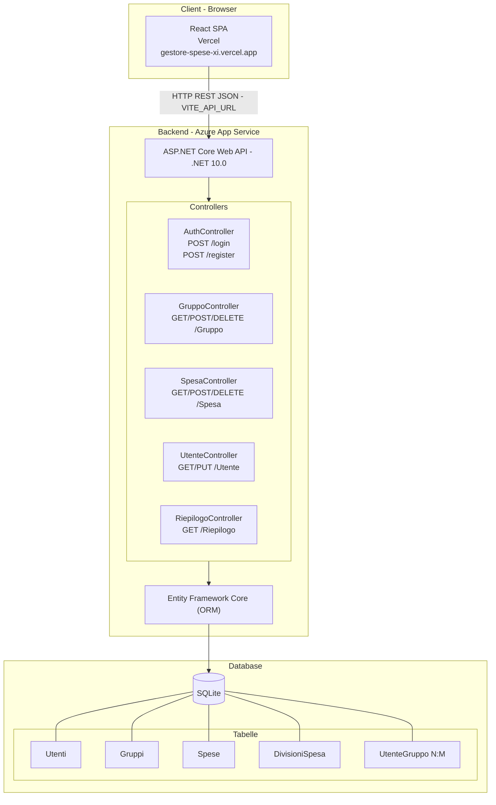
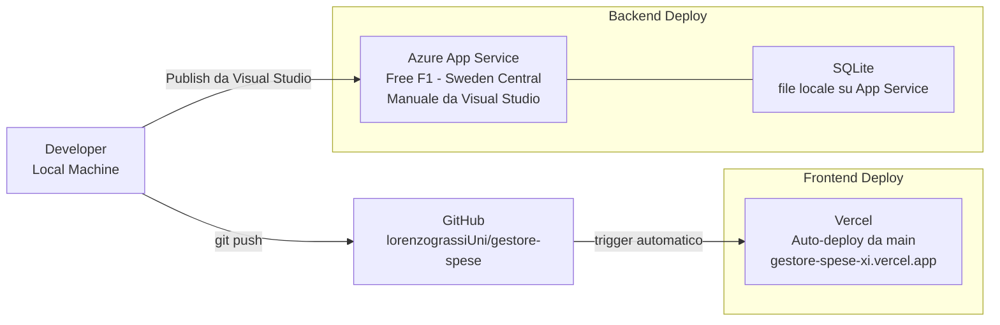
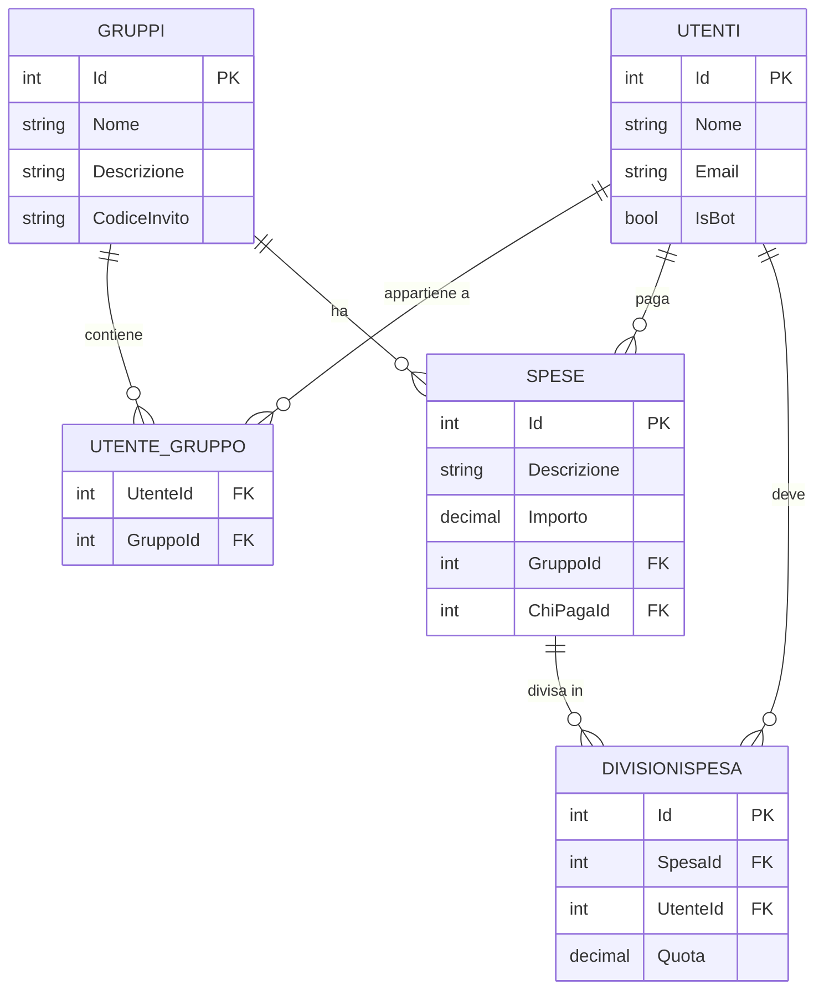

# Diagramma Architettura - Split Mate

## Architettura Generale

```mermaid
graph TB
    subgraph CLIENT["Client - Browser"]
        UI["React SPA\nVercel\ngestore-spese-xi.vercel.app"]
    end

    subgraph BACKEND["Backend - Azure App Service"]
        API["ASP.NET Core Web API - .NET 10.0"]
        subgraph CONTROLLERS["Controllers"]
            AC["AuthController\nPOST /login\nPOST /register"]
            GC["GruppoController\nGET/POST/DELETE /Gruppo"]
            SC["SpesaController\nGET/POST/DELETE /Spesa"]
            UC["UtenteController\nGET/PUT /Utente"]
            RC["RiepilogoController\nGET /Riepilogo"]
        end
        EF["Entity Framework Core (ORM)"]
    end

    subgraph DB["Database"]
        SQLITE[("SQLite")]
        subgraph TABELLE["Tabelle"]
            T1["Utenti"]
            T2["Gruppi"]
            T3["Spese"]
            T4["DivisioniSpesa"]
            T5["UtenteGruppo N:M"]
        end
    end

    UI -- "HTTP REST JSON - VITE_API_URL" --> API
    API --> CONTROLLERS
    CONTROLLERS --> EF
    EF --> SQLITE
    SQLITE --- T1 & T2 & T3 & T4 & T5
```

---

## Architettura di Deploy

```mermaid
graph LR
    DEV["Developer\nLocal Machine"]
    GH["GitHub\nlorenzograssiUni/gestore-spese"]

    subgraph FRONTEND_DEPLOY["Frontend Deploy"]
        VERCEL["Vercel\nAuto-deploy da main\ngestore-spese-xi.vercel.app"]
    end

    subgraph BACKEND_DEPLOY["Backend Deploy"]
        AZURE["Azure App Service\nFree F1 - Sweden Central\nManuale da Visual Studio"]
        AZUREDB["SQLite\nfile locale su App Service"]
    end

    DEV -- "git push" --> GH
    GH -- "trigger automatico" --> VERCEL
    DEV -- "Publish da Visual Studio" --> AZURE
    AZURE --- AZUREDB
```

---

## Schema del Database

```mermaid
erDiagram
    UTENTI {
        int Id PK
        string Nome
        string Email
        bool IsBot
    }
    GRUPPI {
        int Id PK
        string Nome
        string Descrizione
        string CodiceInvito
    }
    SPESE {
        int Id PK
        string Descrizione
        decimal Importo
        int GruppoId FK
        int ChiPagaId FK
    }
    DIVISIONISPESA {
        int Id PK
        int SpesaId FK
        int UtenteId FK
        decimal Quota
    }
    UTENTE_GRUPPO {
        int UtenteId FK
        int GruppoId FK
    }

    UTENTI ||--o{ UTENTE_GRUPPO : "appartiene a"
    GRUPPI ||--o{ UTENTE_GRUPPO : "contiene"
    GRUPPI ||--o{ SPESE : "ha"
    UTENTI ||--o{ SPESE : "paga"
    SPESE ||--o{ DIVISIONISPESA : "divisa in"
    UTENTI ||--o{ DIVISIONISPESA : "deve"
```
